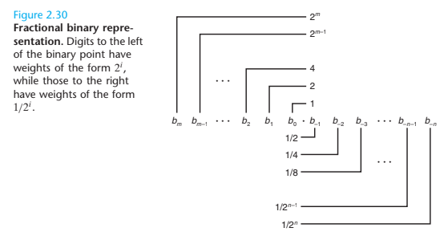

# 부동 소수점

부동 소수점이란, 다음과 같은 형태의 유리수를 인코딩하는 방법이다.

$$V = x \times 2^{y}$$

이는 매우 큰 숫자($V > 0$)와, 작은 숫자($V < 0$), 그리고 실수 연산의 근사치로 사용된다.

1980년대 이후, [IEEE 754](https://ko.wikipedia.org/wiki/IEEE_754) 표준이 부동 소수점 연산의 표준화를 이루어 갔으며, 현재 서로 다른 시스템 간의 호환성을 보장하고 수치적 안정성을 향상시키는데 기여하고 있다.

이 섹션에서는 IEEE 754에서 정의된 부동 소수점 연산 표준을 살펴보며, 숫자가 형식에서 정확하게 표현될 수 없을 때, 발생하는 반올림 문제, 부동 소수점 간의 연산 또한 살펴본다.

## 소수점을 가진 숫자를 이진수로 표현

10의 양의 거듭제곱으로 소수를 가진 실수를 나타낸다면 다음과 같다.

$$12.3410 = 1 \times 10^1 + 2 \times 10^0 + 3 \times 10^{-1} + 4 \times 10^{-2} = \frac {1234}{100}$$

이를 이진 숫자로 나타낸다면 소수부를 가진 실수 $b$를 다음과 같이 정의할 수 있다.

$$b = \sum^{m}_{i = -n} 2 ^i \times b_i$$

아래의 식에서 $.$은 이진 소수점을 나타낸다.

$$101.112 = 1 \times 2^2 + 0 \times 2 ^1 + 1 \times 2^{-1} + 1 \times 2^{-2} = 4 + 0 + 1 + \frac {1}{2} + \frac {1}{4} = \frac {53}{4}$$

위의 표현 방식은 부동 소수점 숫자를 이해하고 구현하는데 중요한 역할을 한다.

### 소수의 이진 표현의 한계

$$b = \sum^{m}_{i = -n} 2 ^i \times b_i$$

위의 방정식에서 알 수 있 듯, 소수의 이진 표현은 $x \times 2^{-n}$의 형태의 소수만을 정확하게 나타낼 수 있으며, $\frac {1}{3}$, $\frac {1}{5}$와 같은 소수는 근사치로만 표현할 수 있다.

