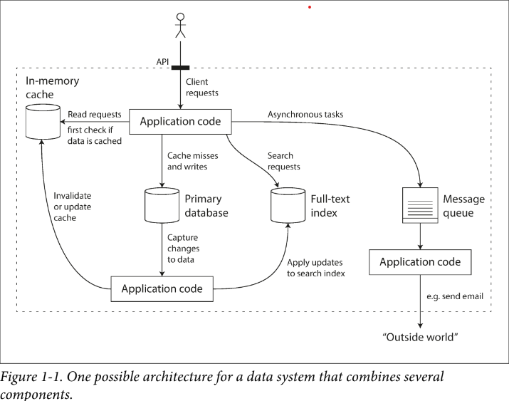

# 신뢰성 있고, 확장 가능하며, 유지 보수가 수월한 애플리케이션

오늘날의 애플리케이션은 계산 집약적이기 보다는 **데이터 집약적**이다.

대부분의 애플리케이션은 다음과 같은 기능이 반드시 필요하다.

1. 데이터 CRUD (데이터베이스)
2. 자원이 많이 소모되는 연산 결과를 기억하고 읽기 속도를 높임(캐시)
3. 사용자가 키워드로 검색하거나, 필터링할 수 있게 함 (검색 엔진)
4. 비동기적 처리를 위한 메시징 (스트림 처리)
5. 주기적으로 많은 양의 축적 데이터를 처리 (배치 처리)

매우 복잡한 요구사항으로 인해, Trade-Off를 고려하여 적합한 방식을 채택하는 능력은 더 중요해졌으며, 단일 도구로는 할 수 없는 요구 사항들이 많아졌다.

이 장에서는 데이터 시스템의 기본 원칙을 탐구해본다.

## 데이터 시스템 생각해보기

일반적으로 데이터베이스, 큐, 캐시 등을 다른 범주의 도구라고 생각하지만 오늘날에는 이러한 경계가 희미해지고 있다. 즉, 하나의 도구만으로 모든 데이터의 처리 및 저장 요구를 충족시킬 수 없다.

애플리케이션 코드에서는 이러한 도구들을 적절하게 동기화하는 책임이 있다.

위의 그림에서, API는 일반적으로 클라이언트에게 구현 세부 사항을 숨긴다. 우리는 클라이언트의 어떤 행위에도 서비스를 보장할 수 있어야 한다. 우리는 아래의 질문에 대답할 수 있어야 한다.

- 내부에서 문제가 발생해도, 데이터가 정확하고 완전한 상태로 유지할 수 있는 방법은 무엇인가?
- 시스템의 일부가 약화되도, 클라이언트에게 일관된 성능을 어떻게 제공할 수 있는가?
- 부하가 증가할 때 어떻게 확장할 수 있는가
- 서비스에 적합한 API는 어떤 모습인가

대부분의 소프트웨어 시스템에서 중요한 세 가지 관심사는 다음과 같다.

1. **신뢰성(Reliability)**
- 시스템은 어떤 상황(하드웨어, 소프트웨어, 인간의 실수를 포함한 모든 상황)에서도 올바른 기능을 원하는 수준에서 정확하게 수행해야 한다.

2. **확장성 (Scalability)**
- 시스템이 데이터 양, 트래픽 양 또는 복잡성이 증가함에 따라 성장에 대처할 수 있어야 한다.

3. **유지보수성 (Maintainability)**
- 시간이 지남에 따라 다양한 사람들이 시스템을 작업하며, 이들 모두 생산적으로 작업할 수 있어야 한다.

## 신뢰성
소프트웨어에서 일반적으로 기대되는 것
- 사용자가 기대한 기능을 수행
- 사용자의 실수, 예상치 못한 사용에 대한 대응
- 예상된 부하와 데이터 양에 대한 성능
- 불법적인 접근과 남용 방지

신뢰서은 한 마디로 말하면, **문제가 발생해도 지속적으로 정확하게 작동하는 것**을 의미한다.

### 결함과 실패

결함은 시스템의 한 구서 요소가 명세에서 벗어나는 것을 의미하고, 실패는 시스템이 사용자에게 필요한 서비스를 제공하지 못할 때 발생한다.

결함률을 제로로 만드는 것은 불가능하지만, 결함이 실패로 이어지지 않도록 결함 허용 메커니즘을 설계하는 것이 최선이다.

결함을 의도적으로 유발함으로써 오류 처리를 명확히 하고, 이를 지속적으로 테스트하고 검증해야한다.([Chaos Monkey](https://netflix.github.io/chaosmonkey/))

### 하드웨어 결함

하드 디스크의 평균 고자까지의 시간(MTTF)은 10년에서 50년 사이이다. 따라서 10,000개의 디스크로 구성된 스토리지 클러스터에서 평균적으로 하루에 한 개의 디스크가 고장날 것으로 예상할 수 있다.

다음과 같은 경우로 하드웨어 결함률을 낮출 수 있다.

- 개별 하드웨어 구성 요소를 중복된 요소가 대체(디스크 [RAID](https://ko.wikipedia.org/wiki/RAID), 서버의 이중 전원 공급장치)
- 롤링 업그레이드 (서비스 중단 없이, 한 노드씩 업그레이드 하는 것)

### 소프트웨어 결함
서로 무작위적이로 독립적이라 기대되는 하드웨어와는 달리, 시스템 내부에서의 오류, 즉 소프트웨어 결함은 예측하기 어렵고 노드 간에 연관으로 인해 훨씬 많은 시스템 실패를 초래할 수 있다.

- 특정 악성 입력에 서버의 모든 인스턴스가 충돌
- CPU 시간, 메모리, 디스크 공간, 네트워크 대역폭을 지속적으로 소모하는 Runaway 프로세스
- 시스템이 의존하는 서비스가 느려져, 손상된 응답을 반환
- 연쇄 실패(한 노드의 결함이 다른 노드의 결함을 일으킴)

보통 소프트웨어 결함은 특정한 상황에만 트리거되는 경우가 많다. 여기에 대한 빠른 해결책은 없다.

설계, 테스트, 프로세스 격리, 충돌한다면, 바로 재시작할 수 있는 환경 제공, 운영 환경 모니터링 및 분석을 통해 점점 소프트웨어 결함을 줄여가는 방식을 택해야 한다.

### 인간 결함

대규모 인터넷 서비스의 연구에 따르면, 운영자에 의한 설정 오류가 장애의 주요 원인이며, 하드웨어 결함은 10 ~ 25%에 불과했다.

인간을 신뢰할 수 없음에도, 다음과 같은 접근을 통해 시스템을 신뢰할 수 있게 만들 수 있다.

- 실수 가능성의 최소화(추상화 API, 너무 제한적인 추상화는 피한다)
- 실수 가능성이 높은 곳과 장애 발생률이 높은 곳을 분리시킨다. (개발, 테스트, 운영 서버의 분리)
- 모든 수준에서의 테스트(단위, 통합, 수동 테스트 자동화)
- 실수가 발생했을 때에 대비한 신속하고 쉬운 복구 프로세스(설정 변경 롤백, 점진적 소스 코드 배포)
- 성능 지표, 오류율 모니터링 ([텔레메트리](https://velog.io/@kwakwoohyun/MSA-Telemetry%ED%85%94%EB%A0%88%EB%A9%94%ED%8A%B8%EB%A6%AC))
- 좋은 관리 실천과 교육

### 신뢰성의 중요성
버그는 생산성 손실 뿐만 아니라, 법적 리스크를 초래할 수도 있다. 비즈니스가 중요하지 않더라도, 갑자기 삭제된 데이터를 복구할 수 없다면 사용자에겐 매우 치명적이다.

하지만 개발 비용 저감(스타트업의 프로토타입 제품 개발)을 위해 신뢰성을 희생할 수 있다. 하지만 어떠한 중요 부분을 선택해야할지 고려하는 것이 매우 중요하다.

