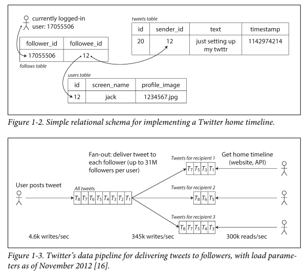
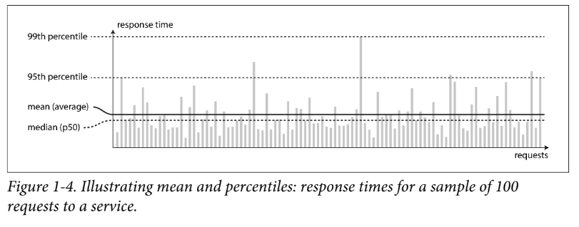
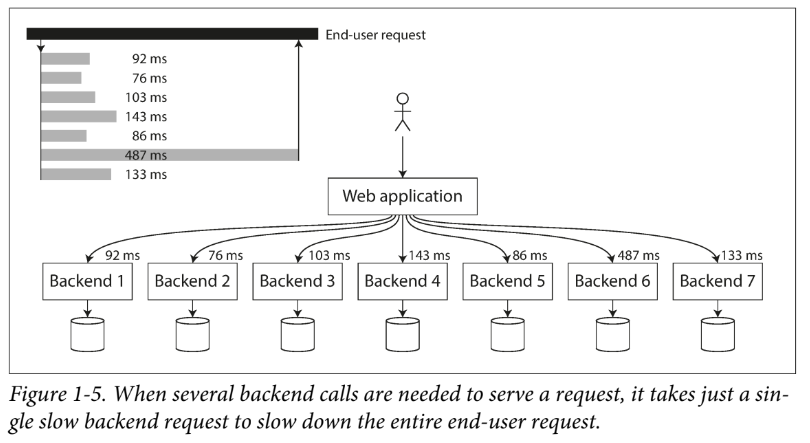

# 신뢰성 있고, 확장 가능하며, 유지 보수가 수월한 애플리케이션

오늘날의 애플리케이션은 계산 집약적이기 보다는 **데이터 집약적**이다.

대부분의 애플리케이션은 다음과 같은 기능이 반드시 필요하다.

1. 데이터 CRUD (데이터베이스)
2. 자원이 많이 소모되는 연산 결과를 기억하고 읽기 속도를 높임(캐시)
3. 사용자가 키워드로 검색하거나, 필터링할 수 있게 함 (검색 엔진)
4. 비동기적 처리를 위한 메시징 (스트림 처리)
5. 주기적으로 많은 양의 축적 데이터를 처리 (배치 처리)

매우 복잡한 요구사항으로 인해, Trade-Off를 고려하여 적합한 방식을 채택하는 능력은 더 중요해졌으며, 단일 도구로는 할 수 없는 요구 사항들이 많아졌다.

이 장에서는 데이터 시스템의 기본 원칙을 탐구해본다.

## 데이터 시스템 생각해보기

일반적으로 데이터베이스, 큐, 캐시 등을 다른 범주의 도구라고 생각하지만 오늘날에는 이러한 경계가 희미해지고 있다. 즉, 하나의 도구만으로 모든 데이터의 처리 및 저장 요구를 충족시킬 수 없다.

애플리케이션 코드에서는 이러한 도구들을 적절하게 동기화하는 책임이 있다.


위의 그림에서, API는 일반적으로 클라이언트에게 구현 세부 사항을 숨긴다. 우리는 클라이언트의 어떤 행위에도 서비스를 보장할 수 있어야 한다. 우리는 아래의 질문에 대답할 수 있어야 한다.

- 내부에서 문제가 발생해도, 데이터가 정확하고 완전한 상태로 유지할 수 있는 방법은 무엇인가?
- 시스템의 일부가 약화되도, 클라이언트에게 일관된 성능을 어떻게 제공할 수 있는가?
- 부하가 증가할 때 어떻게 확장할 수 있는가
- 서비스에 적합한 API는 어떤 모습인가

대부분의 소프트웨어 시스템에서 중요한 세 가지 관심사는 다음과 같다.

1. **신뢰성(Reliability)**
- 시스템은 어떤 상황(하드웨어, 소프트웨어, 인간의 실수를 포함한 모든 상황)에서도 올바른 기능을 원하는 수준에서 정확하게 수행해야 한다.

2. **확장성 (Scalability)**
- 시스템이 데이터 양, 트래픽 양 또는 복잡성이 증가함에 따라 성장에 대처할 수 있어야 한다.

3. **유지보수성 (Maintainability)**
- 시간이 지남에 따라 다양한 사람들이 시스템을 작업하며, 이들 모두 생산적으로 작업할 수 있어야 한다.


## 신뢰성
소프트웨어에서 일반적으로 기대되는 것
- 사용자가 기대한 기능을 수행
- 사용자의 실수, 예상치 못한 사용에 대한 대응
- 예상된 부하와 데이터 양에 대한 성능
- 불법적인 접근과 남용 방지

신뢰서은 한 마디로 말하면, **문제가 발생해도 지속적으로 정확하게 작동하는 것**을 의미한다.

### 결함과 실패

결함은 시스템의 한 구서 요소가 명세에서 벗어나는 것을 의미하고, 실패는 시스템이 사용자에게 필요한 서비스를 제공하지 못할 때 발생한다.

결함률을 제로로 만드는 것은 불가능하지만, 결함이 실패로 이어지지 않도록 결함 허용 메커니즘을 설계하는 것이 최선이다.

결함을 의도적으로 유발함으로써 오류 처리를 명확히 하고, 이를 지속적으로 테스트하고 검증해야한다.([Chaos Monkey](https://netflix.github.io/chaosmonkey/))


### 하드웨어 결함

하드 디스크의 평균 고자까지의 시간(MTTF)은 10년에서 50년 사이이다. 따라서 10,000개의 디스크로 구성된 스토리지 클러스터에서 평균적으로 하루에 한 개의 디스크가 고장날 것으로 예상할 수 있다.

다음과 같은 경우로 하드웨어 결함률을 낮출 수 있다.

- 개별 하드웨어 구성 요소를 중복된 요소가 대체(디스크 [RAID](https://ko.wikipedia.org/wiki/RAID), 서버의 이중 전원 공급장치)
- 롤링 업그레이드 (서비스 중단 없이, 한 노드씩 업그레이드 하는 것)

### 소프트웨어 결함
서로 무작위적이로 독립적이라 기대되는 하드웨어와는 달리, 시스템 내부에서의 오류, 즉 소프트웨어 결함은 예측하기 어렵고 노드 간에 연관으로 인해 훨씬 많은 시스템 실패를 초래할 수 있다.

- 특정 악성 입력에 서버의 모든 인스턴스가 충돌
- CPU 시간, 메모리, 디스크 공간, 네트워크 대역폭을 지속적으로 소모하는 Runaway 프로세스
- 시스템이 의존하는 서비스가 느려져, 손상된 응답을 반환
- 연쇄 실패(한 노드의 결함이 다른 노드의 결함을 일으킴)

보통 소프트웨어 결함은 특정한 상황에만 트리거되는 경우가 많다. 여기에 대한 빠른 해결책은 없다.

설계, 테스트, 프로세스 격리, 충돌한다면, 바로 재시작할 수 있는 환경 제공, 운영 환경 모니터링 및 분석을 통해 점점 소프트웨어 결함을 줄여가는 방식을 택해야 한다.


### 인간 결함

대규모 인터넷 서비스의 연구에 따르면, 운영자에 의한 설정 오류가 장애의 주요 원인이며, 하드웨어 결함은 10 ~ 25%에 불과했다.

인간을 신뢰할 수 없음에도, 다음과 같은 접근을 통해 시스템을 신뢰할 수 있게 만들 수 있다.

- 실수 가능성의 최소화(추상화 API, 너무 제한적인 추상화는 피한다)
- 실수 가능성이 높은 곳과 장애 발생률이 높은 곳을 분리시킨다. (개발, 테스트, 운영 서버의 분리)
- 모든 수준에서의 테스트(단위, 통합, 수동 테스트 자동화)
- 실수가 발생했을 때에 대비한 신속하고 쉬운 복구 프로세스(설정 변경 롤백, 점진적 소스 코드 배포)
- 성능 지표, 오류율 모니터링 ([텔레메트리](https://velog.io/@kwakwoohyun/MSA-Telemetry%ED%85%94%EB%A0%88%EB%A9%94%ED%8A%B8%EB%A6%AC))
- 좋은 관리 실천과 교육

### 신뢰성의 중요성
버그는 생산성 손실 뿐만 아니라, 법적 리스크를 초래할 수도 있다. 비즈니스가 중요하지 않더라도, 갑자기 삭제된 데이터를 복구할 수 없다면 사용자에겐 매우 치명적이다.

하지만 개발 비용 저감(스타트업의 프로토타입 제품 개발)을 위해 신뢰성을 희생할 수 있다. 하지만 어떠한 중요 부분을 선택해야할지 고려하는 것이 매우 중요하다.


## 확장 가능성(Scalability)

오늘날의 시스템이 신뢰성 있게 작동하고 있다고 해서, 미래에도 신뢰성 있게 작동할 것이라는 보장은 없다.

확장성은 **시스템이 증가된 부하를 처리할 수 있는 능력**을 의미한다. 이것은 시스템에 탈부착 가능한 단일 차원의 레이블의 문제가 아니다. 예를 들어 "$X$는 확장 가능하고, $Y$는 확장 되지 않는다."라고 말하는 것은 의미가 없다. 관리되는 서비스에 따라 확장을 선택할 수 있는 방식이 달라지며, 추가적인 부하를 처리하기 위해 컴퓨팅 자원을 어떻게 추가할 것인가에 대한 질문을 고려해야 한다.

### 부하(Load)
시스템에 가해지는 부하(Load)의 매개변수에 대한 정의는 시스템의 아키텍쳐에 따라 달라질 수 있으나, 보통은 다음과 같은 경우로 정의할 수 있다.

- 웹 서버에 대한 초당 요청 수
- 데이터베이스의 읽기와 쓰기 비율
- 채팅방에서 동시에 활동 중인 사용자 수
- 캐시의 적중률
- ...

시스템에 따라, 평균 또는 극단적인 사례가 중요할 수 있다.

다음의 트윗 사례를 보며, 부하의 개념에 대해 구체적으로 살펴보자

트위터의 주요 작업
1. Post Tweet
    - 사용자가 팔로워에게 새로운 메시지를 게시 (평균 4.6k Request/s, 최대 12k)
2. Home Timeline
    - 사용자가 팔로우하는 사람들이 게시한 트윗을 볼 수 있음(300k Request/s)

위의 두 작업을 구현하는 방법

1. 단순히 새로운 트윗을 전역 트윗 모음(데이터 베이스)에 삽입

```SQL
SELECT tweets.*, users.* 
FROM tweets
JOIN users ON tweets.sender_id = users.id
JOIN follows ON follows.followee_id = users.id
WHERE follows.follower_id = current_user
```
사용자가 자신의 타임라인을 요청하면, 그들이 팔로우하는 모든 사람을 찾고, 각 사용자의 모든 트윗 찾아, 시간 순서대로 병합한다.

2. 각 사용자의 홈 타임라인에 대한 캐시를 유지한다.

한 사용자는, 그를 팔로우하는 사람들에 대한 메일 박스처럼 동작한다. 사용자가 트윗을 게시하면, 그를 팔로우하는 모든 사람들을 찾아 홈 타임라인 캐시에 새로운 트윗을 삽입한다. 이는 1번 방식에 비해 비용이 적게 든다.



실제로 트위터의 첫번째 버전은 방식 1을 사용했으나, 쿼리의 부하로 인해 방식 2로 변경했다. 방식 2 또한 단점이 있는데, 트윗을 게시하는데 많은 추가 작업이 필요하다는 것이다.

평균적으로 하나의 트윗은 75명의 팔로워에게 전달되며, 초당 4.6k의 트윗은 홈 타임라인 캐시에 대해 초당 345k 개의 쓰기가 된다.
하지만, 만약 3000만 명 이상의 팔로워를 가진 사용자라면, 한 번의 트윗이 3000만 번 이상의 쓰기를 일으킬 수 있음을 의미한다.

트위터의 부하 매개 변수에서 사용자 당 팔로워 분포는 매우 중요한 지표이다.

실제론, 트위터는 유명 인사들은 별도로 처리(쿼리, 방식 1)하며, 대부분의 사용자는 방식 2번을 사용하며 처리한다.


### 성능(Performance)
부하가 증가할 발생하는 상황을 다음과 같은 방식으로 알아볼 수 있다.

- 부하 매개변수를 증가시키고 시스템 자원(CPU, 메모리, 네트워크 대역폭 등)을 변경하지 않은 상태에서 시스템 성능이 어떻게 영향을 받는지 확인한다.
- 부하 매개변수를 증가시킬 때, 성능을 유지하려면 자원을 얼마나 늘려야 하는지 확인한다.

위의 두 방식 모두 **성능 지표**가 중요하다.

> 지연과 응답 시간(Latency And Response Time) 
> - 응답 시간: 클라이언트가 보는 시간(요청 처리 시간 + 네트워크 지연 + 대기 지연 etc..)
> - 지연: 요청이 처리되기를 기다리는 동안의 지속 시간, 즉 서비스 대기 상태의 시간

같은 요청이라도 응답 시간은 달라지므로, 단일 숫자가 아닌 측정할 수 있는 분포로 생각해야 한다.



위의 그림에서 $x$축은 요청, $y$축은 응답 시간을 뜻하며, 대부분 비슷한 추이를 보이지만, 가끔 훨씬 더 오래걸리는 예외가 있다.

다음과 같은 이유로 무작위적인 지연이 발생할 수 있다.
- 백그라운드 프로세스로의 컨텍스트 스위칭
- 네트워크 패킷 손실과 TCP 재전송
- 가비지 컬렉션 일시 중지
- 디스크에서 읽기를 강제하는 [페이지 폴트](https://velog.io/@jiseong/OS-%EA%B0%80%EC%83%81%EB%A9%94%EB%AA%A8%EB%A6%AC%EC%99%80-%ED%8E%98%EC%9D%B4%EC%A7%80%ED%8F%B4%ED%8A%B8-gyq8tftz)
- 서버 랙의 기계적 진동
- ...

서비스 시간을 응답 시간에 대한 평균으로 나타내는 경우가 많지만, 이러한 단순 계산은 얼마나 많은 클라이언트가 지연을 경험에 대한 지표를 보여주진 않아 적절한 지표라고 볼 수 없다.

평균 보다는, 백분위수(Percentile) 사용해 응답 시간을 정렬한 뒤의 중간값($p50$)을 기준으로 클라이언트가 일반적으로 경험하는 응답 시간을 알 수 있다.

클라이언트의 요청 절반은 $p50$보다 오래, 나머지는 $p50$보다 짧게 처리된다. 단, 이는 단일 요청에 대한 지표이며, 단일 페이지에서 여러 요청이 오갈 때는 그중 하나가 $p50$보다 느릴 확률은 50%보다 훨씬 높다.

이상값(Outlier)이 얼마나 나쁜지 보려면, 더 높은 백분위수를 살펴볼 수 있다. 그림에서 $p95$, $p99$와 같은 상위 백분위의 응답 시간을 꼬리 지연(Tail Latency)이라고 하며, 이를 서비스 수준 목표치(SLO, Service Level Objective)나 서비스 수준 계약(SLA, Service
Level Agreements)로 사용하는 경우가 많다.

예를 들어, 아마존은 내부 서비스에 대한 응답 시간 요구 사항을 $p99.9$ 기준으로 설명하는데, 이는 1,000개의 요청 중 1개에만 클라이언트의 경험에 영향을 미치더라도 사용자가 이탈할 수 있기 때문이다. 게다가 이러한 지연 요청을 하는 클라이언트는 기업 입장에서 가장 가치 있는 고객이며, 이들에게 좋은 사용자 경험을 주는 것이 중요하다. 이러한 지표는 서비스 클라이언트에 대한 기대치를 설정하고, SLA가 충족되지 않을 경우 고객이 환불을 요구할 수 있도록 한다.

아마존은 응답 시간이 100ms 증가할 때 판매가 1% 감소한다고 관찰했으며, 다른 보고서에 따르면 1초의 지연은 고객 만족도를 16% 감소시킨다.

그렇다고, $p99.99$(10000개의 요청 중 1개)와 같이 매우 높은 백분위수  성능을 최적화하는 것이 올바른 것은 아니다. 이러한 이상값은 제어할 수 없는 무작위 이벤트에 의해 발생할 확률이 높으며 이를 최적화 하는 것은 많은 비용이 발생하며, 제어하기도 쉽지 않다.



일반적으로 대기 지연(Queueing Delays)은 높은 백분위수 응답 시간에 가장 영향을 미치는 요소 중 하나이다. 서버는 병렬로 처리할 수 있는 작업의 수(CPU 코어 수의 제한)이 한정되어 있으며, 소수의 느린 요청이 이후 요청 전체를 지연시킬 수 있다.([헤드 라인 오브 블로킹](https://velog.io/@dnr6054/HOL-Blocking))

> 꼬리 지연 증폭(Tail Latency Amplification) </br>
> 백엔드 호출의 작은 비율만 느려도, 최종 사용자 요청에 여러 백엔드 호출이 필요하다면 느린 호출을 만날 가능성이 증가하고, 따라서 더 많은 비율의 최종 사용자 요청이 느려지게 된다. </br>
> 이를 지속적으로 모니터링 하기 위해서는 롤링 윈도우 기법을 사용해 분 당, 응답 시간을 지속적으로 확인할 수 있다 </br>

### 최소한의 CPU 및 메모리 비용으로 백분위수의 근삿값을 계산할 수 있는 알고리즘
- Forward Decay
- t-digest
- HdrHistogram
