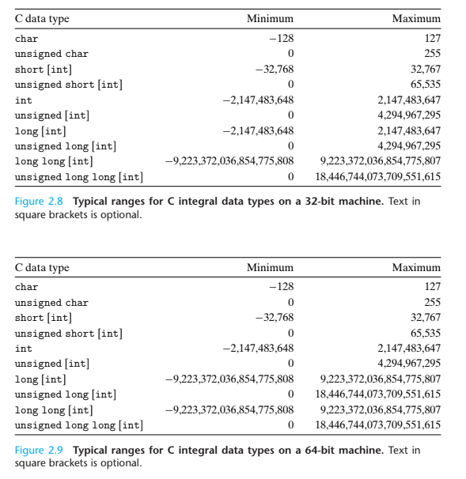
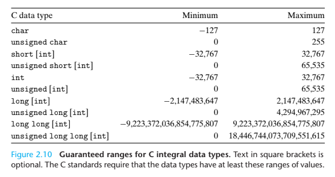
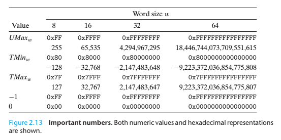

# Integer Representations

## C 정수형 데이터 타입

아래의 그림은 C의 정수형 데이터 타입이 가질 수 있는 값의 범위를 기계의 워드 크기에 따라 보여준다.

위의 그림과 아래의 그림을 비교했을 때, 음수부만 다른데, 이는 음수가 어떻게 비트로 표현되는지 알면 그 이유를 알 수 있다.

## 부호 없는 정수의 인코딩 (Unsigned Encoding)

부호 없는 정수는 이진값과 정수 사이에 항상 일대일 대응 관계(bijection)을 갖는다.

## 2의 보수 인코딩 (Two's Complement Encoding)

총 w개의 비트 중 최상위 비트를 x(w-1) 이라고 할 때, 이 비트의 가중치를 기준으로 음수를 만드는 방법이다.

## 최상위 비트 (MSB)

