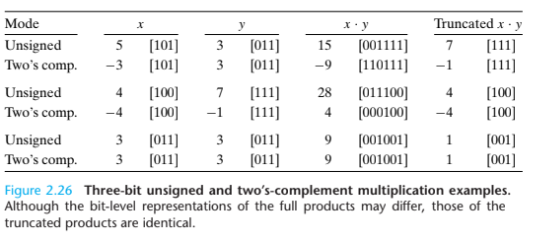

# 정수 산술

## 부호 없는 정수(Unsigned)의 덧셈

두 부호 없는 정수 $x$, $y$를 고려해보자

$x$, $y$는 다음을 따른다.

$$ 0 \le x, y \le 2^w - 1 $$

만약 x, y를 덧셈하게 되면 범위는 다음과 같이 바뀐다.

$$ 0 \le x, y \le 2^{w+1} - 2 $$

즉, 이 합을 표현하기 위해서는 $w + 1$ 개의 비트가 필요한 것이다. 또한 이 값을 유지하고 다른 값을 더하려면 $w + 2$ 개의 비트가 필요할 수 있다.

### 오버플로우

unsinged int $x$, $y$가 덧셈할 때, 다음의 경우에 오버 플로우가 일어난다.

$$ x + y \ge x$$

## 2의 보수(Signed)의 덧셈

두 이진 보수 $x$, $y$는 다음을 따른다.

$$ -2^{w - 1} \le x, \space y \le 2^{w - 1} - 1 $$

즉, $x + y$의 범위는 다음과 같다.

$$ -2^w \le x + y \le 2^{w} -2 $$

### 오버플로우

    Two's Complement Addition
    - signed int x, y를 덧셈할 경우, w를 비트수라고 할 때, 다음의 3가지 경우로 나눌 수 있다.
        - 2^{w - 1} <= x + y -> Negative Overflow
        - -2^{w - 1} <= x + y < 2^{w - 1} -> Normal
        - x + y < -2^{w - 1} -> Positive Overflow

Singed Int $x$, $y$를 덧셈할 경우, $w$를 비트 수라고 할 때, 다음의 3가지 경우로 나눌 수 있다.

-   Negative Overflow
    -   $x$와 $y$가 양수이고, $x + y$가 음수인 경우

$$ 2^{w - 1} \le x + y $$

-   Normal

$$ -2^{w - 1} \le x + y \lt 2^{w - 1} $$

-   Positive Overflow
    -   $x$와 $y$가 음수이고, $x + y$가 양수인 경우

$$ x + y \lt -2^{w - 1}$$

## 2의 보수의 부정(Two's Complement Negation)

2의 보수인 $x$가 존재할 때, $x + y = 0$을 만족하는 $y$($x$의 역원)를 구하고자 한다. 다음의 절차를 따른다.

1. $x$에 대한 1의 보수(One's complement)를 구한다.

-   $x$ 가 $1001_{(2)}$ 일 때, 1의 보수는 $0110_{(2)}$ 이다.

2. $x$의 1의 보수에 1을 더한다.

-   $0110_{(2)} + 1 = 0111_{(2)}$

$y$는 $0111_{(2)}$가 된다.

즉, 한 2의 보수 x의 값은 다음이 성립한다고 볼 수 있다.
$$ -x = \space \sim x + 1 $$

### 두 보수의 역원을 쉽게 표현하는 방법

비트 벡터를 가장 오른쪽 1의 위치를 기준으로 두 부분으로 나누어, 왼쪽 부분만을 반전시키는 방법이 있다.

예를 들어, $11001000_{(2)}$의 가장 오른쪽 1을 기준으로 나누면, $1100$과 $1000$으로 나눌 수 있으며, 왼쪽 부분만 반전하면 $0011$이 된다. 즉, $11001000_{(2)}$의 역원은 $00111000_{(2)}$가 된다.

## 부호 없는 정수의 곱셈

부호 없는 정수인 $x$, $y$는 $0 \le x, \space y \le 2^{w} - 1$의 범위 내에 있고, $x \times y$는 다음을 만족한다.
$$ 0 \le x \times y \le 2^{2w} - 2^{w + 1} + 1$$

C에서는 이를 표현하려면 최대 $2w$의 비트가 필요하므로, 부호 없는 곱셈에서는 정수 곱의 하위 $w$ 비트 값을 반환하도록 정의되어 있다. 부호 없는 정수 간의 곱셈을 $*u\_w$ 라고 할 때, 다음을 만족한다.

$$ x \space *u_w y = (x \times y) \space mod \space2^w$$

## 2의 보수 간의 곱셈
부호 있는 정수(Signed Integer) $x$, $y$의 범위는 다음과 같다.

$$ -2^{w-1} \le x, y \le 2^{w - 1} - 1$$

$x$, $y$ 간의 곱셈의 범위는 다음과 같다.

$$ -2^{2w - 2} + 2^{w - 1} \le x \times y \le 2^{2w - 2}$$

이는 최대 $2w$ 비트수가 부호 있는 정수의 곱을 나타낼 때 필요하다는 의미이다.

C에서는 부호 있는 정수 곱셈은 $w$ 비트 내에서 처리된다. 두 w 비트 $x$, $y$의 곱이 $2w$가 되더라도, 다시 $w$ 비트로 줄여서 표현하게 된다.

 부호 있는 정수 간의 곱셈 연산을 $*t_w$라고 한다면 다음과 같은 방정식이 성립한다.

$$ x \times t_wy = (x \times y) \space mod \space 2^{w}$$

즉, 부호 있는 정수와 부호 없는 정수 간의 결과는 모듈러 연산(나머지 연산)으로 계산하는 것은 동일하나, 결과를 표현하는 방식이 다를 뿐이다.

